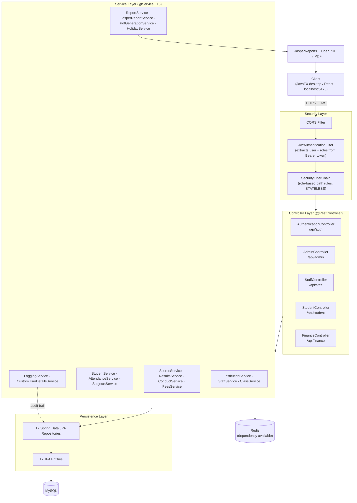
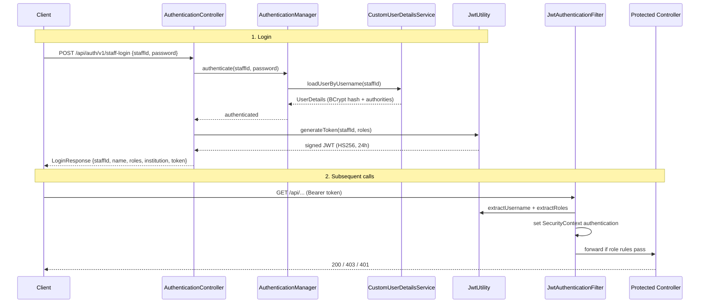

# School Management System — Backend

A multi-tenant **School Management System** REST API built with **Spring Boot 3.5.6** and **Java 21**. It handles institution onboarding, staff and student management, class/level and semester (term) administration, subject scoring and result compilation, conduct grading, attendance tracking, fee billing and payments, a two-dimensional activity log, and PDF report generation via JasperReports (terminal report cards, SBA reports, and master score sheets).

The system is **multi-tenant**: every record is scoped to an `Institution`, and a school joins the platform using a subscription code before any staff or students can be created.

---

## Tech Stack

| Concern | Technology |
|---|---|
| Language | Java 21 |
| Framework | Spring Boot 3.5.6 (Web, Data JPA, Security, Data Redis) |
| Database | MySQL (`mysql-connector-j`), Hibernate `ddl-auto=update` |
| Auth | Spring Security + JWT (`jjwt` 0.11.5), stateless sessions, BCrypt |
| Reporting | JasperReports 7.0.3 + `jasperreports-pdf`; OpenPDF 2.0.3 for direct PDF assembly |
| Caching | Spring Data Redis (dependency present) |
| Config | `dotenv-java` (loads `.env` into system properties at startup) |
| Boilerplate | Lombok |
| Build | Maven (wrapper included: `mvnw`) |

> Change from earlier revisions: the PDF dependency migrated from iText/`com.lowagie` to **OpenPDF 2.0.3**.

---

## Architecture Overview

The backend follows a conventional layered Spring MVC architecture: **Controller → Service → Repository → Entity**, with DTOs crossing the controller boundary, a JWT filter in front of the controllers, and a reporting layer (JasperReports + OpenPDF) producing PDF deliverables.



### Package layout

```
com.codewithben.schoolmanagementsystem
├── SchoolManagementSystemApplication   # entry point (loads .env, enables web security)
├── CompileReport                       # JasperReports .jrxml → .jasper compilation helper
├── Config/        SecurityBean         # security filter chain, CORS, password encoder, auth manager
├── Constants/     (enums)              # StaffRoles, LogType, LogAction, AttendanceStatus, ConductRatings, etc.
├── Controller/    (5)                  # REST endpoints grouped by audience/role
├── Service/       (16)                 # business logic (split into focused services)
├── Repository/    (17)                 # Spring Data JPA interfaces
├── Entity/        (17)                 # JPA-mapped domain model
├── DTO/           (13 groups)          # request/response payloads by domain
└── Utility/                            # JWT, exception handling, auth event listeners, ID generation
```

> Note: the constants package was previously misspelled `Contants` and has since been **corrected to `Constants`**.

### Service layer (split for single responsibility)

The service layer was decomposed from a small set of broad services into 16 focused ones:

| Service | Responsibility |
|---|---|
| `InstitutionService` | Tenant onboarding, grading criteria |
| `StaffService` | Staff CRUD, counts, password reset |
| `ClassService` | Classes/levels and semesters (terms), caches |
| `StudentService` | Student CRUD, rosters, counts |
| `AttendanceService` | Marking and querying attendance |
| `SubjectsService` | Subject CRUD per level |
| `ScoresService` | Saving and loading subject scores |
| `ResultsService` | Result compilation, class results, SBA/master views |
| `ConductService` | Conduct records per class+semester |
| `FeesService` | Fee setup, payments, fee reports |
| `ReportService` | Orchestrates PDF report generation |
| `JasperReportService` | JasperReports template filling (report cards, SBA, class cards) |
| `PdfGenerationService` | OpenPDF assembly (master score sheet) |
| `HolidayService` | School holidays |
| `LoggingService` | Two-dimensional audit logging |
| `CustomUserDetailsService` | Spring Security user loading |

---

## Domain Model (Entity Relationships)

`Institution` is the tenant root. Almost every other entity links back to it.

```mermaid
erDiagram
    INSTITUTION ||--o{ STAFFS : employs
    INSTITUTION ||--o{ STUDENTS : enrolls
    INSTITUTION ||--o{ LEVEL : has
    INSTITUTION ||--o{ SEMESTER : defines
    INSTITUTION ||--o{ FEES : bills
    INSTITUTION ||--o{ FEESREPORT : records
    INSTITUTION ||--o{ LOGS : audits
    INSTITUTION ||--o{ GRADESYSTEM : configures
    INSTITUTION ||--o{ SCHOOLHOLIDAY : schedules

    STAFFS ||--o{ STAFFROLESENTITY : "has roles"
    STAFFS ||--o{ LEVEL : "is class teacher of"
    STAFFS ||--o{ LOGS : "creates"

    LEVEL ||--o{ SUBJECTS : contains
    LEVEL ||--o{ STUDENTS : "groups"
    LEVEL ||--o{ FEES : "priced by"

    SEMESTER ||--o{ FEES : "billed per"
    SEMESTER ||--o{ RESULTS : "scoped to"
    SEMESTER ||--o{ SCHOOLHOLIDAY : "spans"

    STUDENTS ||--o{ SUBJECTSCORE : earns
    STUDENTS ||--o{ RESULTS : "receives"
    STUDENTS ||--o{ CONDUCT : "graded on"
    STUDENTS ||--o{ FEESREPORT : "pays via"
    STUDENTS ||--o{ ATTENDANCE : "tracked by"

    SUBJECTS ||--o{ SUBJECTSCORE : "scored in"

    RESULTS ||--o{ SUBJECTSCORE : aggregates
    RESULTS ||--|| CONDUCT : "paired with"

    FEES ||--o{ FEESREPORT : "settled by"

    INSTITUTION {
        string institutionId PK
        string institutionName
    }
    STAFFS {
        string staffId PK
        string firstName
        string lastName
        string email
        string password
        StaffStatus staffStatus
    }
    STUDENTS {
        string studentId PK
        string firstName
        string lastName
        StudentStatus studentStatus
    }
    LEVEL {
        string levelID PK
        string levelName
    }
    SEMESTER {
        string semesterID PK
        string academicYear
        date semesterStartDate
        date semesterEndDate
    }
    SUBJECTS {
        string subjectId PK
        string subjectName
    }
    SUBJECTSCORE {
        long id PK
        double classScore
        double examScore
        double totalScore
        string grade
    }
    RESULTS {
        long resultId PK
        double totalScore
        double averageScore
        string position
    }
    CONDUCT {
        long id PK
        ConductRatings regular
        ConductRatings punctual
        string classTeacherRemark
    }
    FEES {
        int feesId PK
        double amountToBePayed
    }
    FEESREPORT {
        string feesReportId PK
        double amountPaid
        double feesBalance
    }
    ATTENDANCE {
        long id PK
        date dateMarked
        AttendanceStatus status
    }
    LOGS {
        int actionId PK
        LogType type
        LogAction action
        LogStatus status
        date actionDate
    }
}
```

### Entity notes

- **Logs** now carries two enum dimensions — `type` (`LogType`) and `action` (`LogAction`) — plus `status`, `actionData` (5000-char detail), the acting staff, and the institution. (See the logging section below.)
- **Results ↔ Conduct** — one-to-one; conduct grading (six `ConductRatings` dimensions + a class-teacher remark) attaches to a student's semester result. `Results` holds `totalScore`, `averageScore`, and class `position`.
- **SubjectScore** — stores granular components (project work, group work, two class tests, class score, exam score, calculated exam score) before rolling up into a `Results` row.
- **StaffRolesEntity** — models many-roles-per-staff; one staff member can hold several roles (e.g. `PRINCIPAL` + `ACCOUNTANT`).
- **EntityID_generation** — a counter table (`entityName`, `code`) used by `UtilityClass.generateEntityId(...)` to issue readable prefixed IDs: institution `INS`, staff `ST`, student `STD`, subject `SUB`, level `LV`, semester `SE`, report `RP`, transaction `TX`.

---

## Enums (`Constants`)

| Enum | Values |
|---|---|
| `StaffRoles` | `PRINCIPAL`, `ACCOUNTANT`, `TEACHING_STAFF`, `GENERAL_STAFF`, `ADMINISTRATOR` |
| `LogType` | `ATTENDANCE`, `CONDUCT`, `FEES`, `GRADE`, `INSTITUTION`, `CLASS`, `LOG`, `RESULT`, `REPORT`, `SCHOOL_HOLIDAY`, `TERM`, `STAFF`, `STUDENT`, `SUBJECT`, `SUBJECT_SCORE` (15) |
| `LogAction` | `CREATE`, `READ`, `UPDATE`, `DELETE`, `PROMOTE`, `LOGIN`, `RESET`, `SUBSCRIPTION` (8) |
| `AttendanceStatus` | `PRESENT`, `ABSENT` |
| `ConductRatings` | `EXCELLENT`, `VERY_GOOD`, `GOOD`, `FAIR`, `NOT_TO_EXPECTATION` |
| `HolidayType` | `PUBLIC_HOLIDAY`, `MID_TERM_BREAK`, `SCHOOL_EVENT`, `EMERGENCY_CLOSURE` |
| `LogStatus` | `SUCCESS`, `FAILED` |
| `StaffStatus` | `ACTIVE`, `INACTIVE` |
| `StudentStatus` | `ACTIVE`, `INACTIVE`, `COMPLETED` |
| `DeletionStatus` | `TRUE`, `FALSE` |

---

## Audit Logging (two-dimensional)

Logging was refactored from a single flat 50-value enum into **two orthogonal dimensions**: `LogType` (which entity/domain was touched) and `LogAction` (what was done). This cuts the constant count to 15 + 8 = 23 and lets logs be queried along both axes ("everything that touched fees" vs "all deletions"). The `Logs` entity stores both as `@Enumerated(EnumType.STRING)` columns, alongside the existing rich `actionData` text.

`LoggingService` exposes:

```java
void logGeneralActivity(LogType type, LogAction action, String message, String staffId, LogStatus status);
void logNewSubscription(LogType type, LogAction action, String message, LogStatus status, Institution institution);
```

Logs are queryable through three admin endpoints: recent activity, per-staff over a date range, and time-window across the institution.

---

## Roles & Authorization

Roles (`StaffRoles`): **`PRINCIPAL`**, **`ACCOUNTANT`**, **`TEACHING_STAFF`**, **`GENERAL_STAFF`**, **`ADMINISTRATOR`**. Authorization is enforced per URL prefix in `SecurityBean`:

| Path prefix | Allowed authorities |
|---|---|
| `/api/auth/**` | Public (no auth) |
| `/api/finance/**` | `ACCOUNTANT`, `PRINCIPAL` |
| `/api/student/**` | `PRINCIPAL`, `ADMINISTRATOR`, `ACCOUNTANT`, `TEACHING_STAFF` |
| `/api/staff/**` | `ADMINISTRATOR`, `TEACHING_STAFF`, `PRINCIPAL`, `ACCOUNTANT` |
| `/api/admin/**` | `ADMINISTRATOR`, `PRINCIPAL`, `ACCOUNTANT`, `TEACHING_STAFF` |
| any other | Authenticated |

Sessions are **stateless**; every protected request must carry `Authorization: Bearer <jwt>`. The JWT encodes the staff ID (subject) and a `roles` claim, valid for **24 hours**.

### Authentication & request flow



---

## REST API Reference

All non-auth endpoints expect a `staffId` request header (used to scope and audit the action) plus the `Bearer` token. Versioning is embedded in the path (`/v1`, `/v2`).

### `/api/auth` — Authentication & onboarding (public)

| Method | Path | Purpose |
|---|---|---|
| POST | `/v1/school-subscription` | Register a new institution (requires valid subscription code) |
| POST | `/v1/enroll-new-staff` | Enroll the first principal/staff for an existing institution |
| POST | `/v1/staff-login` | Authenticate and receive a JWT |

### `/api/admin` — Administration

| Method | Path | Purpose |
|---|---|---|
| POST | `/v1/reset-staff-password` | Reset another staff member's password |
| POST | `/v1/add-semester` | Create a semester/term |
| POST | `/v1/new-grading-criteria` | Define grading bands |
| GET | `/v1/load-grading-criteria` | Load grading criteria |
| PUT | `/v1/update-grading-criteria` | Update grading criteria |
| GET | `/v1/find-class-info/{levelId}` | Fetch class details |
| PUT | `/v1/update-class-info` | Update class details |
| PUT | `/v1/update-staff-info` | Update staff details |
| GET | `/v1/search-semester/{semesterId}` | Fetch semester details |
| PUT | `/v1/update-semester-info` | Update semester |
| POST | `/v1/add-new-class` | Create a class/level with an instructor |
| POST | `/v1/add-subject` | Add a subject to a level |
| GET | `/v1/load-subject-data/{subjectId}` | Load a subject |
| PUT | `/v1/update-subject-details` | Update a subject |
| DELETE | `/v1/delete-subject/{subjectId}` | Delete a subject |
| GET | `/v2/generate-class-report` | Generate bulk class report cards (PDF) |
| GET | `/v2/generate-sba-report` | Generate SBA report for a subject (PDF) |
| GET | `/v2/generate-master-sheet` | Generate master score sheet (PDF) |
| GET | `/v1/recent-logs` | Recent activity log |
| GET | `/v1/get-staff-logs` | Logs for a specific staff over a date range |
| GET | `/v1/get-timely-logs` | Logs across the institution over a date range |
| POST | `/v1/add-holiday` | Add a holiday |
| GET | `/v1/load-holidays` | List holidays |
| PUT | `/v1/update-holiday` | Update a holiday |

### `/api/staff` — Staff & academics

| Method | Path | Purpose |
|---|---|---|
| GET | `/v1/total-staffs` · `/v1/total-teaching-staffs` | Headcount metrics |
| GET | `/v1/staff-list` · `/v1/load-staffs-info` | Staff directory / cache |
| GET | `/v1/find-staff-by-id/{instructorId}` | Find a staff member |
| POST | `/v1/add-new-staff` | Enroll a staff member (under caller's institution) |
| GET | `/v1/load-staff-grades` · `/v1/load-levels` · `/v1/load-classes` | Classes/levels for the staff |
| GET | `/v1/load-semesters` | Semester cache |
| GET | `/v1/load-subjects/{levelId}` | Subjects in a level |
| GET | `/v1/view-class-results` | View class semester results |
| GET | `/v1/report-card` | Preview a student report card (data) |
| GET | `/v1/view-sba` | Preview SBA data for a subject |
| GET | `/v1/view-master-sheet` | Preview master score sheet data |
| POST | `/v1/promote-student/{studentId}/{levelId}` | Promote a student |
| GET | `/v1/conduct-records` | Conduct records for a class+semester |
| PUT | `/v1/save-conduct-record` | Save student conduct |

### `/api/student` — Students, attendance, scoring

| Method | Path | Purpose |
|---|---|---|
| GET | `/v1/absent-students` | Today's absentees |
| GET | `/v1/total-students` | Student count |
| GET | `/v1/find-student/{studentId}` | Find a student |
| POST | `/v1/add-new-student` | Enroll a student |
| PUT | `/v1/update-student-data` | Update personal data |
| GET | `/v1/load-students/{levelId}` | Students in a level |
| GET | `/v1/load-subject-students/{subjectId}` | Students taking a subject |
| POST | `/v1/save-subject-scores` | Save subject scores (headers: `subjectId`, `semesterId`) |
| GET | `/v1/load-students-for-attendance/{levelId}/{date}` | Attendance roster |
| POST | `/v1/mark-attendance` | Mark attendance (header: `selectedDate`) |
| GET | `/v2/generate-report-card` | Generate a single student's report card (PDF; header: `promotionId`) |

### `/api/finance` — Fees & payments

| Method | Path | Purpose |
|---|---|---|
| POST | `/v1/add-new-fees` | Set fees for a grade+semester |
| POST | `/v2/new-fees` | Set fees for a class+semester (newer variant) |
| POST | `/v1/add-fees-payment` | Record a payment |
| GET | `/v1/fetch-payment-records` | Individual payment records |
| PUT | `/v1/update-payment-details` | Update a payment |
| DELETE | `/v1/delete-payment-record/{transactionId}` | Delete a payment |
| GET | `/v1/search-fees-report` | Student fees report |
| GET | `/v1/fetch-grade-fees-report/{levelId}/{semesterId}` | Grade-level fees report |
| GET | `/v1/class-summary-fees` | Class fees summary |
| GET | `/v1/total-fees` · `/v1/fees-paid` | Aggregate totals |
| GET | `/v1/fetch-fees-details/{semesterId}/{levelId}` | Fee details |
| PUT | `/v1/update-semester-fees` | Update fee amount |
| GET | `/v1/recent-fees-transactions` | Recent transactions |

---

## Reporting Subsystem

Three PDF deliverables are produced through a two-path reporting layer:

- **Terminal report cards** — per-student and bulk per-class, rendered by `JasperReportService` from the `student_report_card` Jasper template (runtime subject and conduct tables).
- **SBA report** — per-subject continuous-assessment sheet, rendered by `JasperReportService` from the `sba_report` template, fed by `SbaReport` / `SbaRecords` DTOs.
- **Master score sheet** — variable-subject grid, assembled directly with **OpenPDF** in `PdfGenerationService`, fed by `MasterScoreSheet` / `MasterScoreSheetRow` DTOs (built at runtime because the subject columns are dynamic).

`ReportService` orchestrates which generator runs; `CompileReport` compiles `.jrxml` → `.jasper`. Templates and assets live under `src/main/resources/reports/Daffodils/` (per-school folder; Daffodils International School is the reference client), including `student_report_card.jrxml/.jasper`, `sba_report.jrxml/.jasper`, the school logo, and the principal signature image.

---

## Configuration

Configuration is supplied through `.env` (loaded at startup by `dotenv-java`) and `application.properties`. Secrets are now referenced via placeholders rather than hard-coded in source.

| Variable | Used for |
|---|---|
| `MYSQL_URL` | JDBC URL |
| `MYSQL_ROOT_PASSWORD` | DB password |
| `JWT_SECRET` | JWT signing key (`@Value("${jwt.secret}")`) |
| `SUBSCRIPTION_CODE` | Onboarding gate (`@Value("${subscription.code}")`) |
| `SERVER_PORT` | HTTP port (default 8080) |

`application.properties` also sets `jwt.expiration=86400000` (24h), `spring.jpa.hibernate.ddl-auto=update`, and `spring.jpa.show-sql=true`. CORS allows `http://localhost:5173` and a Vercel frontend origin.

---

## Running Locally

**Prerequisites:** JDK 21, MySQL running, (optional) Redis.

```bash
# 1. Create the database
mysql -u root -p -e "CREATE DATABASE schoolmanagementsystem;"

# 2. Provide a .env at the project root with at least:
#    MYSQL_URL, MYSQL_ROOT_PASSWORD, JWT_SECRET, SUBSCRIPTION_CODE

# 3. Run with the Maven wrapper
./mvnw spring-boot:run            # macOS/Linux
mvnw.cmd spring-boot:run          # Windows

# Build a jar instead
./mvnw clean package
java -jar target/SchoolManagementSystem-0.0.1-SNAPSHOT.jar
```

The API will be available at `http://localhost:8080`. Hibernate creates/updates the schema automatically on first run.

---

## ⚠️ Security Notes

Resolved since earlier revisions:
- **JWT secret externalized** — now injected via `@Value("${jwt.secret}")`, no longer hard-coded in `JwtUtility`.
- **Subscription code externalized** — now `@Value("${subscription.code}")` instead of a literal in the controller.

Still worth addressing before production:
1. **Committed DB credentials** — `application.properties` keeps a real-looking Railway password as the default fallback (`${MYSQL_ROOT_PASSWORD:...}`). Rotate it and remove the inline default so the value comes only from the environment.
2. **JWT filter trusts token claims without re-validating the user** — `JwtAuthenticationFilter` builds the security context from token claims but does not re-load the account or explicitly handle parsing exceptions; consider verifying the staff still exists/active.
3. **CSRF disabled** — acceptable for a stateless token API, but confirm it matches your threat model.

---

## Project Facts

- **17** JPA entities · **17** repositories · **16** services · **5** controllers
- **13** DTO domain groups (Attendance, Auth, Class, Conduct, Fees, Holiday, Logs, Report, Result, Semester, Staff, Students, Subject)
- Base package: `com.codewithben.schoolmanagementsystem`
- Maven artifact: `com.codewithBen:SchoolManagementSystem:0.0.1-SNAPSHOT`
